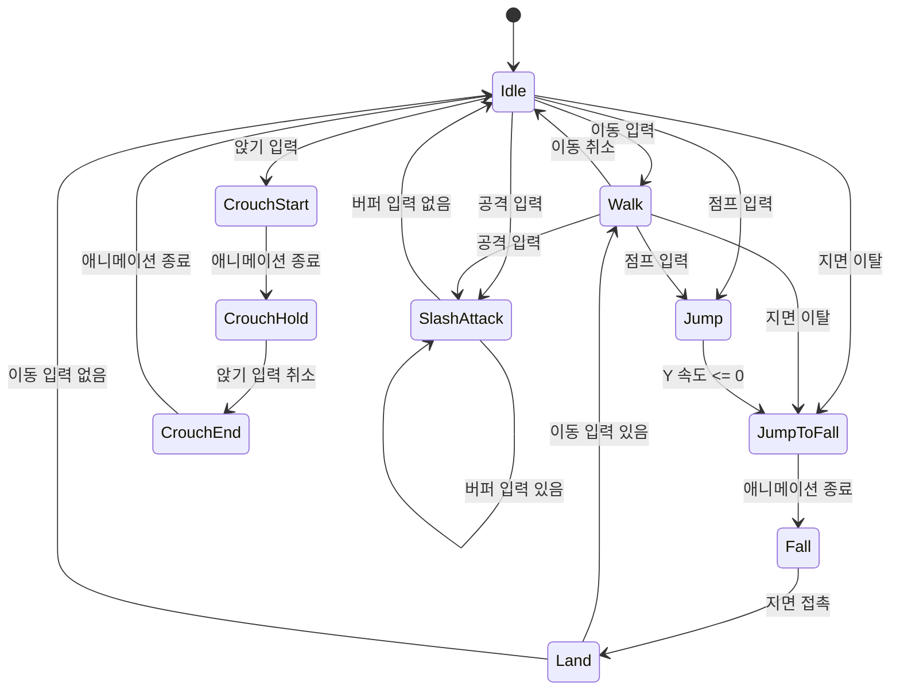

# DarkSeries 코드 분석 문서

## 1. 문서 범위

이 문서는 `Assets/Scripts` 아래의 직접 작성된 C# 코드를 기준으로 현재 구조와 동작을 정리한다.

- `PlayerActionMap.cs`는 Unity Input System이 `PlayerActionMap.inputactions`에서 자동 생성한 코드이므로 구현 분석 대상에서 제외한다.
- 씬, Animator Controller, Animation Clip은 코드와 연결되는 범위에서만 설명한다.
- 이 문서는 현재 구현을 기록한 분석 문서이며 코드 수정 제안은 마지막의 주의 사항에 분리했다.

## 2. 전체 구조

```text
Player
├─ PlayerInputController      입력 액션과 이동 입력값 관리
├─ PlayerMoveController       Rigidbody2D 이동, 점프, 지면 판정
└─ SwordMaster
   ├─ PlayerData              이동·점프 수치 데이터
   ├─ SwordMasterAnimData     Animator 파라미터 이름과 해시
   ├─ SwordMasterAttackController
   │                          연속 베기 인덱스와 입력 버퍼
   └─ StateMachine<SwordMaster>
      ├─ Idle / Walk / Run
      ├─ Jump / JumpToFall / Fall / Land
      ├─ SlashAttack
      └─ CrouchStart / CrouchHold / CrouchEnd
```

핵심 설계는 `SwordMaster`가 Unity 생명주기를 받고, 실제 행동 규칙은 현재 상태 객체에 위임하는 유한 상태 머신 방식이다.

## 3. 실행 흐름

### 초기화

1. `Player.Awake()`가 `SpriteRenderer`, `Animator`, `PlayerMoveController`, `PlayerInputController`를 가져온다.
2. `SwordMaster.Awake()`가 공격 컨트롤러를 가져오고 Animator 파라미터 해시를 초기화한다.
3. `SwordMaster.Start()`가 상태 머신과 상태 객체를 만들고 `Idle`을 최초 상태로 지정한다.
4. 각 상태의 `Enter()`는 베이스 상태를 통해 필요한 Input Action 콜백을 연결한다.

### 매 프레임

- `SwordMaster.Update()`
  - 현재 Movement 값을 읽어 `movementInput`에 저장한다.
  - 현재 상태의 `Update()`를 호출한다.
- `SwordMaster.LateUpdate()`
  - 현재 상태의 `LateUpdate()`를 호출한다.
- `SwordMaster.FixedUpdate()`
  - 현재 상태의 `FixedUpdate()`를 호출한다.
  - 입력의 X 방향으로 실제 Rigidbody2D 이동을 수행한다.
  - 이동 방향에 따라 스프라이트를 좌우 반전한다.
- `PlayerMoveController.FixedUpdate()`
  - 캐릭터 아래쪽의 `OverlapBox`로 Platform 레이어 접촉 여부를 갱신한다.

## 4. 공통 시스템

### `IState<T>`

모든 상태가 구현해야 하는 생명주기를 정의하는 추상 베이스 클래스다.

- `Enter()` / `Exit()`: 상태 진입과 종료
- `Update()` / `LateUpdate()` / `FixedUpdate()`: Unity 업데이트 단계에 대응
- `OnAnimationEnd()`: Animation Event가 상태에 애니메이션 종료를 알리는 선택적 콜백

이름은 인터페이스처럼 보이지만 실제로는 추상 클래스다.

### `StateMachine<T>`

상태 인스턴스를 타입별 Dictionary에 보관한다. `ChangeState<TState>()`가 호출되면 현재 상태의 `Exit()`, 다음 상태 지정, 다음 상태의 `Enter()` 순서로 전환한다.

상태는 실행 중 새로 생성하지 않고 시작 시 한 번 생성해 재사용한다. 따라서 각 상태 객체 안에 필드를 추가할 경우 다음 진입에도 값이 유지된다는 점을 고려해야 한다.

### `PlayerInputController`

Input System 자동 생성 래퍼인 `PlayerActionMap`을 소유한다.

- 활성화될 때 전체 액션을 Enable
- 비활성화될 때 전체 액션을 Disable
- Movement는 폴링하여 `movementInput`에 보관
- Attack, Jump, Crouch 등 순간 행동은 상태가 콜백을 직접 구독

현재 입력 구성은 다음과 같다.

| 액션 | 바인딩 | 코드 사용 방식 |
|---|---|---|
| Attack | 마우스 왼쪽 버튼 | 상태 콜백 |
| Movement | A/D 2D Vector | 매 프레임 폴링 및 상태 콜백 |
| Jump | Space | 상태 콜백 |
| Crouch | S | 상태 콜백 |
| Run | Left Shift | Input Action에는 존재하지만 상태 베이스에서 아직 연결하지 않음 |

### `PlayerMoveController`

Rigidbody2D의 `linearVelocityX/Y`를 직접 변경한다.

- `Move(direction)`: `moveSpeed * direction`을 X 속도로 설정
- `Jump()`: `jumpPower`를 Y 속도로 설정
- 지면 판정: 캐릭터 위치에 offset을 더한 지점에서 Box overlap 검사
- Scene 뷰 선택 시 지면 판정 박스를 Gizmo로 표시

`moveSpeed`와 `jumpPower`는 상태가 진입할 때 현재 행동에 맞게 설정한다.

### `PlayerData`

ScriptableObject로 캐릭터 수치를 에셋에 분리한다.

- 기본 이동 속도
- 걷기 속도 배율
- 달리기 속도 배율
- 기본 점프 힘
- 점프 힘 배율

실제 걷기 속도는 `baseSpeed * walkSpeedModifier`, 달리기 속도는 `baseSpeed * runSpeedModifier`, 점프 힘은 `baseJumpPower * jumpPowerModifier`로 계산한다.

## 5. SwordMaster 구성 요소

### `SwordMaster`

Player의 구체 캐릭터 구현이며 다음 역할을 묶는다.

- 상태 머신 생성과 상태 등록
- Unity 업데이트를 상태 머신에 전달
- 물리 이동 및 바라보는 방향 갱신
- Animation Event의 `OnAnimationEnd()`를 현재 상태에 전달
- `OnGUI()`로 현재 상태 이름을 화면에 표시하는 디버그 UI 제공

현재 등록된 상태는 Idle, Walk, SlashAttack, Jump, JumpToFall, Fall, Land, CrouchStart, CrouchHold, CrouchEnd다.

### `SwordMasterAnimData`

Inspector에 저장된 Animator 파라미터 문자열을 정수 해시로 변환한다.

| 파라미터 | 사용 목적 |
|---|---|
| Idle | 대기 애니메이션 |
| Walk | 걷기 애니메이션 |
| Run | 달리기 애니메이션 |
| RunFast | 빠른 달리기 확장용 |
| Attack | 공격 애니메이션 |
| IsGround | 지상/공중 분기 |
| StartFall | 낙하 전환 애니메이션 |
| Fall | 낙하 루프 |
| Land | 착지 애니메이션용 |
| Crouch | 앉기 시작/종료 제어 |

`Animator.StringToHash` 결과를 미리 보관하므로 상태 코드에서 매번 문자열을 해시하지 않는다.

### `SwordMasterAttackController`

연속 베기 상태를 관리한다.

- `BufferSlash()`: 공격 중 다음 공격 입력을 예약
- `ConsumeBuffer()`: 예약 입력이 있으면 소비하고 true 반환
- `IncreaseCombo()`: 콤보 인덱스를 증가시키며 3을 넘으면 0으로 순환
- `ResetCombo()`: 입력 버퍼와 콤보 인덱스를 초기화

현재 콤보 인덱스 범위는 0~3이다.

## 6. 상태별 동작

### 지상 이동 상태

#### `SwordMaster_Idle`

- Idle Animator bool을 켠다.
- 이동 입력이 생기면 Walk로 전환한다.
- 지면에서 떨어지면 JumpToFall로 전환한다.
- Attack, Jump, Crouch 입력을 각각 SlashAttack, Jump, CrouchStart로 연결한다.

#### `SwordMaster_Walk`

- Walk Animator bool을 켠다.
- 걷기 속도를 데이터의 기본 속도와 배율로 계산한다.
- 이동 입력이 취소되면 Idle로 전환한다.
- 공격 또는 점프 입력 시 해당 상태로 전환한다.
- 지면에서 떨어지면 JumpToFall로 전환한다.

#### `SwordMaster_Run`

- Run Animator bool을 켠다.
- 달리기 속도를 데이터의 기본 속도와 배율로 계산한다.
- 현재 파일은 존재하지만 `SwordMaster.InitializeStates()`에 등록되지 않았고 Run 입력 콜백도 연결되지 않아 실행 경로가 완성되지 않았다.

### 공중 상태

#### `SwordMaster_Jump`

- IsGround를 false로 설정한다.
- 데이터에서 점프 힘을 계산하고 Rigidbody2D에 적용한다.
- Y 속도가 0 이하가 되면 JumpToFall로 전환한다.

#### `SwordMaster_JumpToFall`

- StartFall을 켜고 IsGround를 false로 둔다.
- 전환 애니메이션이 끝나면 Fall로 이동한다.

#### `SwordMaster_Fall`

- Fall Animator bool을 켠다.
- 지면이 감지되면 Land로 전환한다.

#### `SwordMaster_Land`

- IsGround를 true로 만들고 이동 속도를 0으로 둔다.
- 착지 애니메이션 종료 시 이동 입력이 있으면 Walk, 없으면 Idle로 이동한다.

### 공격 상태

#### `SwordMaster_SlashAttack`

- 현재 콤보 인덱스를 Animator의 `ComboIndex`에 전달한다.
- Attack bool을 켜고 이동 속도를 0으로 설정한다.
- 공격 중 추가 공격 입력을 버퍼에 저장한다.
- 애니메이션 종료 시 버퍼가 없으면 콤보를 초기화하고 Idle로 돌아간다.
- 버퍼가 있으면 콤보 인덱스를 증가시키고 다음 공격 애니메이션을 이어간다.

### 앉기 상태

#### `SwordMaster_CrouchStart`

- Crouch bool을 켜고 이동 속도를 0으로 만든다.
- 시작 애니메이션 종료 시 CrouchHold로 이동한다.

#### `SwordMaster_CrouchHold`

- Crouch 입력이 취소될 때까지 유지한다.
- 입력 취소 시 CrouchEnd로 이동한다.

#### `SwordMaster_CrouchEnd`

- Crouch bool을 끈다.
- 종료 애니메이션이 끝나면 Idle로 이동한다.

## 7. 상태 전환 요약



Run 상태는 파일과 Animator 파라미터는 있지만 현재 전환 그래프에는 연결되지 않는다.

## 8. 현재 확인되는 주의 사항

아래는 코드를 수정하지 않고 분석 과정에서 확인한 내용이다.

1. `SwordMaster.cs`가 런타임 코드에서 `UnityEditor`를 import한다. Editor에서는 지나갈 수 있지만 플레이어 빌드 시 문제가 될 수 있다.
2. `SwordMaster_Run`은 생성 및 등록되지 않으며 Run 입력도 상태 콜백에 연결되지 않는다.
3. Idle의 `Update()`에서 공중 전환 후 즉시 반환하지 않는다. 같은 프레임에 이동 입력이 있으면 Walk 전환이 다시 실행될 가능성이 있다.
4. `StateMachine`의 Update 계열은 최초 상태가 설정되기 전에 호출되면 null 참조가 발생할 수 있다. 현재 생명주기 순서에서는 Start에서 Idle을 지정한 뒤 일반 Update가 시작되므로 보통은 문제되지 않는다.
5. `PlayerActionMap`은 생성 후 Enable/Disable하지만 명시적으로 Dispose하지 않는다.
6. Jump 상태가 매 프레임 `GetComponent<Rigidbody2D>()`를 호출한다. 기능상 문제는 없지만 이미 `PlayerMoveController`가 같은 Rigidbody2D를 캐시하고 있다.
7. `CrouchStart` 중 S 키를 놓으면 해당 상태에는 취소 처리가 없어 시작 애니메이션이 끝난 뒤 Hold에 진입해야 CrouchEnd로 갈 수 있다.
8. 여러 파일에 사용하지 않는 namespace와 빈 Update override가 남아 있다. 현재 동작에는 영향을 주지 않는다.
9. `OnJumpStatred`는 Started의 오타지만 베이스와 오버라이드가 동일하게 사용하므로 현재 콜백 연결은 동작한다.
10. `Land`용 Animator 해시는 준비되어 있으나 Land 상태 코드에서는 `landParamHash`를 직접 설정하지 않는다. Animator 전이 조건이 IsGround 중심인지 확인할 필요가 있다.

## 9. 기능 확장 시 확인 순서

새 상태를 추가할 때는 다음 연결을 함께 확인해야 한다.

1. 상태 클래스 작성
2. `SwordMaster.InitializeStates()`에서 인스턴스 생성 및 등록
3. 진입 가능한 이전 상태에서 `ChangeState<T>()` 호출
4. 필요한 입력 콜백을 `SwordMaster_BaseState`에 정의하고 구독/해제
5. Animator 파라미터를 `SwordMasterAnimData`에 정의하고 초기화
6. Animator Controller의 파라미터와 전환 구성
7. 종료 애니메이션이 필요한 경우 Animation Event에서 `SwordMaster.OnAnimationEnd()` 호출

